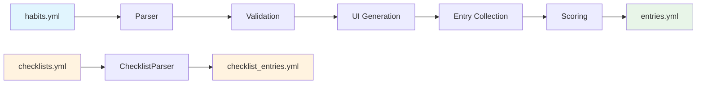

# Architecture.md

## Table of Contents

1. [References](#references)
2. [Architectural Diagrams](#architectural-diagrams)
3. [High-Level Architecture Summary](#high-level-architecture-summary)
   - 3.1 [Core Components](#31-core-components)
   - 3.2 [Data Flow Architecture](#32-data-flow-architecture)
   - 3.3 [Key Architectural Decisions](#33-key-architectural-decisions)
4. [Data Architecture](#4-data-architecture)
   - 4.1 [YAML Schema Structure](#41-yaml-schema-structure)
   - 4.2 [Habit Types and Field Types](#42-habit-types-and-field-types)
   - 4.3 [Entry Storage and Historical Preservation](#43-entry-storage-and-historical-preservation)
   - 4.4 [Specialized Storage: Checklist System](#44-specialized-storage-checklist-system)
5. [Component Architecture](#5-component-architecture)
   - 5.1 [Package Organization](#51-package-organization)
   - 5.2 [Parser Layer Architecture](#52-parser-layer-architecture)
   - 5.3 [Models Layer: Data Structures and Validation](#53-models-layer-data-structures-and-validation)
   - 5.4 [Storage Layer: Atomic Operations](#54-storage-layer-atomic-operations)
   - 5.5 [Scoring Engine Architecture](#55-scoring-engine-architecture)
6. [User Interface Architecture](#6-user-interface-architecture)
   - 6.1 [Hybrid UI Strategy](#61-hybrid-ui-strategy)
   - 6.2 [Entry Collection System](#62-entry-collection-system)
   - 6.3 [Form Generation and Field Type Adaptation](#63-form-generation-and-field-type-adaptation)
   - 6.4 [Navigation and Progress Tracking](#64-navigation-and-progress-tracking)
   - 6.5 [Error Handling and Validation Feedback](#65-error-handling-and-validation-feedback)
7. [Integration Patterns](#7-integration-patterns)
   - 7.1 [CLI Command Structure and Routing](#71-cli-command-structure-and-routing)
   - 7.2 [Configuration Management](#72-configuration-management)
   - 7.3 [File Initialization and Sample Data](#73-file-initialization-and-sample-data)
   - 7.4 [Testing Strategies](#74-testing-strategies)
8. [Extension Points](#8-extension-points)
   - 8.1 [Adding New Habit Types](#81-adding-new-habit-types)
   - 8.2 [Field Type Extensions](#82-field-type-extensions)
   - 8.3 [Scoring Criteria Extensions](#83-scoring-criteria-extensions)
   - 8.4 [Storage Format Evolution](#84-storage-format-evolution)

## References

This section provides context on the key documentation files that inform the architecture:

- **[CLAUDE.md](./CLAUDE.md)** - Primary development guide with design principles, dependencies, and standards. Essential for understanding the clean architecture approach and charmbracelet UI framework usage.
- **[initial_brief.md](./initial_brief.md)** - Original project vision and requirements. Defines core habits: low-friction entry, flexibility, resilience to schema changes, and text-based interoperability.
- **[goal_schema.md](./doc/specifications/goal_schema.md)** - Complete specification of the YAML-based habit configuration format. Critical for understanding data structures and validation rules.
- **[T001_minimal_end_to_end_release.md](./T001_minimal_end_to_end_release.md)** - Foundation implementation covering project setup, configuration management, habit parsing, entry collection, and CLI interface. Shows the core architectural decisions.
- **[T003_implement_elastic_goals_end_to_end.md](./T003_implement_elastic_goals_end_to_end.md)** - Elastic habits with mini/midi/maxi achievement levels. Demonstrates the scoring engine architecture and strategy pattern for habit handlers.
- **[T005_goal_configuration_ui.md](./T005_goal_configuration_ui.md)** - Interactive habit creation system with bubbletea wizards and huh forms. Shows the hybrid UI approach for simple vs complex interactions.
- **[T007_dynamic_checklist_system.md](./T007_dynamic_checklist_system.md)** - Checklist habits with dynamic item management. Illustrates separation between templates (checklists.yml) and instances (checklist_entries.yml).
- **[T010_iter_entry_ui_system.md](./T010_iter_entry_ui_system.md)** - Comprehensive entry collection system with field-type awareness and habit-type adaptation. Shows the strategy pattern for entry handlers and immediate scoring feedback. **Contains architectural diagrams referenced throughout this document.**
- **[flow_analysis_T005.md](./flow_analysis_T005.md)** - Detailed UX flow analysis for habit configuration. Documents the evolution from simple huh forms to enhanced bubbletea wizards.
## Architectural Diagrams

The following diagrams are available in the [diagrams](./diagrams) directory and provide visual representation of the system architecture:

### System Context and Containers

1. Entry System Context
   
   *High-level system context showing how the entry system fits within the broader application ([src](./diagrams/entry_system_context.d2))*

2. Entry System Containers
   
   *Container-level view of the entry collection system architecture ([src]([./diagrams/entry_system_context.d2))*

### Component Architecture Diagrams  

1. 
   *Field input component hierarchy and relationships ([src](./diagrams/field_input_hierarchy.d2))

### Process Flow Diagrams

1. 
   *Habit-based entry collection process flow ([src](./diagrams/goal_collection_flow.d2))*

These diagrams complement the textual architecture descriptions and provide visual reference for developers implementing and extending the system.

## High-Level Architecture Summary

**vice** is a CLI habit tracker designed around three core principles: **low-friction entry**, **schema resilience**, and **text-based interoperability**. The architecture follows clean separation of concerns with a focus on maintaining user data integrity as habits evolve over time.

### Core Components

1. **Schema Management Layer** - YAML-based habit definitions with validation and automatic ID persistence
2. **Entry Collection Layer** - Interactive CLI for recording daily habit data with immediate scoring feedback  
3. **Storage Layer** - Text-based persistence with atomic operations and backup strategies
4. **UI Framework** - Hybrid approach using charmbracelet libraries (huh for forms, bubbletea for complex flows)
5. **Scoring Engine** - Automatic evaluation of entries against habit criteria with achievement levels

### Dependencies

**UI Libraries & frameworks**: charmbracelet/bubbletea, huh, lipgloss & bubbles. See `bubbletea_guide.md`.

**Other Dependencies**:
- **YAML parsing**: goccy/go-yaml
- **Markdown rendering**: charmbracelet/glow
- **Test assertions & mocks**: stretchr/testify
- **Strict formatter**: mvdan/gofumpt
- **Linters**: golangci-lint.run with staticcheck, revive, gosec, errcheck, govet, gocritic, nilnil, nilerr

### Data Flow Architecture



*See [entry_system_context.svg](./diagrams/entry_system_context.svg) for detailed system context diagram.*

### Key Architectural Decisions

- **Text-First Storage**: YAML files as primary storage for version control compatibility and user transparency
- **Strategy Pattern**: Habit type and field type handlers for extensible entry collection (*detailed in [goal_collection_flow.svg](./diagrams/goal_collection_flow.svg)*)
- **Hybrid UI**: Simple huh forms for basic interactions, bubbletea wizards for complex multi-step flows (*see [entry_system_containers.svg](./diagrams/entry_system_containers.svg)*)
- **Separation of Concerns**: Clear boundaries between schema definition, entry collection, scoring, and storage
- **Resilience Design**: Historical entries preserved through schema changes via stable habit IDs

## Data Architecture

### YAML Schema Structure

The vice application uses a declarative YAML-based schema for habit definitions, designed for human readability and version control compatibility:

```yaml
version: "1.0.0"
created_date: "2024-01-01"
habits:
  - title: "Daily Exercise"
    id: "daily_exercise"  # Auto-generated if missing
    goal_type: "elastic"
    field_type:
      type: "duration"
      format: "minutes"
    scoring_type: "automatic"
    mini_criteria: { condition: { greater_than_or_equal: 15 } }
    midi_criteria: { condition: { greater_than_or_equal: 30 } }
    maxi_criteria: { condition: { greater_than_or_equal: 60 } }
```

**Schema Validation Pipeline:**
1. YAML parsing with structure validation
2. Habit type and field type compatibility checks  
3. Scoring criteria validation (mini ≤ midi ≤ maxi for numeric types)
4. Automatic ID generation and persistence for missing IDs
5. Cross-habit uniqueness validation

### Habit Types and Field Types

**Habit Types:**
- **Simple**: Binary pass/fail habits with boolean or single-value fields
- **Elastic**: Three-tier achievement habits (mini/midi/maxi) with criteria-based scoring
- **Informational**: Data collection without pass/fail evaluation, supports direction preferences
- **Checklist**: Dynamic item completion with template/instance separation

**Field Types with Data Validation:**
- `boolean` - True/false values with flexible input parsing (yes/no, y/n, 1/0)
- `text` - String values with optional multiline support
- `unsigned_int`, `unsigned_decimal`, `decimal` - Numeric values with units and constraints
- `time` - HH:MM format with 24-hour validation
- `duration` - Flexible duration parsing (30m, 1h30m, 90m)
- `checklist` - References to external checklist definitions

*Field type adaptation patterns are detailed in [field_input_hierarchy.svg](./diagrams/field_input_hierarchy.svg).*

### Entry Storage and Historical Preservation

**Entry Data Structure:**
```yaml
version: "1.0.0"
entries:
  "2024-01-15":
    daily_exercise:
      value: 45  # Raw user input
      achievement_level: "midi"  # Computed achievement
      notes: "Morning run in the park"
      completed_at: "2024-01-15T07:30:00Z"
```

**Historical Data Resilience:**
- **Stable Habit IDs**: Generated once and persisted, survive title changes
- **Schema Evolution**: Orphaned fields preserved as "historical data"
- **Scoring Context**: Achievement levels reflect criteria active on entry date
- **Atomic Operations**: File writes use temporary files with atomic moves

### Specialized Storage: Checklist System

**Template/Instance Separation:**
- `checklists.yml` - Reusable checklist templates with items and metadata
- `checklist_entries.yml` - Daily completion state by date and checklist ID

**Data Model:**
```yaml
# checklists.yml
checklists:
  - id: "morning_routine"
    title: "Morning Routine"
    items:
      - "# clean station: physical inputs (~5m)"  # Heading
      - "clear desk"                              # Item
      - "clear desk inbox, loose papers"

# checklist_entries.yml  
entries:
  "2024-01-15":
    morning_routine:
      completed_items:
        "clear desk": true
        "clear desk inbox, loose papers": false
      completion_time: "2024-01-15T08:15:00Z"
```

## Component Architecture

### Package Organization

```
vice/
├── cmd/                    # CLI commands and routing
├── internal/
│   ├── config/            # XDG-compliant path resolution
│   ├── models/            # Data structures and validation
│   ├── parser/            # YAML parsing and file operations
│   ├── storage/           # Entry persistence and atomic operations
│   ├── scoring/           # Criteria evaluation engine
│   ├── ui/                # User interface components
│   │   ├── goalconfig/    # Habit creation wizards and forms
│   │   ├── entry/         # Entry collection system (T010)
│   │   └── checklist/     # Checklist management UI
│   └── init/              # File initialization and samples
└── doc/                   # Specifications and documentation
    └── diagrams/          # D2 architecture diagrams
```

*Detailed component relationships are shown in [entry_system_containers.svg](./diagrams/entry_system_containers.svg).*

### Parser Layer Architecture

**GoalParser** (`internal/parser/habits.go`):
- YAML marshaling/unmarshaling with goccy/go-yaml
- Schema validation with automatic ID generation
- Atomic file operations with backup on corruption
- ID persistence detection and conditional saves

**ChecklistParser** (`internal/parser/checklist_parser.go`):
- Template management (CRUD operations)
- Entry state persistence separate from templates
- Heading item filtering (prefixed with "# ")

### Models Layer: Data Structures and Validation

**Core Models** (`internal/models/`):
```go
type Habit struct {
    Title       string      `yaml:"title"`
    ID          string      `yaml:"id,omitempty"`
    GoalType    GoalType    `yaml:"goal_type"`
    FieldType   FieldType   `yaml:"field_type"`
    ScoringType ScoringType `yaml:"scoring_type"`
    // Habit-type specific criteria fields
}

type GoalEntry struct {
    Value            interface{}        `yaml:"value"`
    AchievementLevel *AchievementLevel `yaml:"achievement_level,omitempty"`
    Notes            string            `yaml:"notes,omitempty"`
    CompletedAt      string            `yaml:"completed_at,omitempty"`
}
```

**Validation Strategy:**
- **Field-level validation**: Type checking, format validation, constraint enforcement
- **Cross-field validation**: Criteria ordering (mini ≤ midi ≤ maxi), habit type compatibility
- **Schema-level validation**: ID uniqueness, version compatibility

### Storage Layer: Atomic Operations

**EntryStorage** (`internal/storage/entries.go`):
- **Thread-safe operations**: Mutex protection for concurrent access
- **Atomic writes**: Temporary file + atomic move pattern
- **Backup strategy**: Preserve corrupted files for recovery
- **Query interface**: Date ranges, habit-specific lookups, today helpers

**File Operation Pattern:**
```go
// Atomic write pattern used throughout
tempFile := targetFile + ".tmp"
writeToFile(tempFile, data)
os.Rename(tempFile, targetFile)  // Atomic on most filesystems
```

### Scoring Engine Architecture

**ScoringEngine** (`internal/scoring/engine.go`):
```go
type Engine struct {
    // Stateless evaluation engine
}

func (e *Engine) ScoreElasticGoal(habit models.Habit, value interface{}) 
    (*models.AchievementLevel, error) {
    // Value conversion → Criteria evaluation → Achievement calculation
}
```

**Evaluation Pipeline:**
1. **Value Conversion**: Interface{} → typed values (numeric, duration, time, boolean, text)
2. **Criteria Evaluation**: Apply conditions (greater_than, less_than, equals, range)
3. **Achievement Calculation**: Determine highest achieved level (none/mini/midi/maxi)
4. **Error Handling**: Graceful fallback for incompatible value types

*The complete entry collection process flow is visualized in [goal_collection_flow.svg](./diagrams/goal_collection_flow.svg).*

## User Interface Architecture

### Hybrid UI Strategy

**Decision Matrix for UI Framework Selection:**

| Interaction Type | Framework | Rationale |
|------------------|-----------|-----------|
| Simple confirmations | huh.NewConfirm() | Minimal overhead, perfect for yes/no |
| Basic input collection | huh.NewInput() | Built-in validation, single-step |
| Complex multi-step flows | bubbletea + huh | Navigation, progress, state management |
| Configuration wizards | bubbletea model | Enhanced UX with back/forward navigation |
| Entry collection flows | bubbletea + strategies | Dynamic habit-type adaptation (T010) |

*The UI framework decision process and entry collection architecture are detailed in [entry_system_containers.svg](./diagrams/entry_system_containers.svg).*

**Integration Pattern - Embedding huh in bubbletea:**
```go
type FormStepModel struct {
    form    *huh.Form
    title   string
    step    int
    total   int
}

func (m FormStepModel) Update(msg tea.Msg) (tea.Model, tea.Cmd) {
    form, cmd := m.form.Update(msg)
    m.form = form.(*huh.Form)
    return m, cmd
}
```

### Entry Collection System

**Architecture from T010 Implementation:**

The entry collection system implements a strategy pattern to handle different habit types with specialized UI flows. Each habit type has its own handler that provides appropriate input methods and immediate scoring feedback.

```go
type GoalEntryHandler interface {
    CollectEntry(habit Habit, existing *ExistingEntry) (*EntryResult, error)
    GetPromptText(habit Habit) string
    ValidateInput(habit Habit, input interface{}) error
    FormatPreview(habit Habit, input interface{}) string
}
```

**Habit-Type Specific Handlers:**
- **SimpleGoalHandler**: Binary completion with confirmation prompts
- **ElasticGoalHandler**: Numeric input with real-time achievement level feedback
- **InformationalGoalHandler**: Data collection without scoring constraints  
- **ChecklistGoalHandler**: Interactive item selection with completion tracking

*The entry collection flow and habit-based routing are documented in [goal_collection_flow.svg](./diagrams/goal_collection_flow.svg).*

### Form Generation and Field Type Adaptation

**FieldValueInputFactory** (`internal/ui/entry/field_value_input.go`):
```go
type FieldValueInput interface {
    Render() string
    GetValue() interface{}
    SetExistingValue(value interface{}) error
    Validate() error
    GetPreview() string  // Added in T010 for immediate feedback
}

func CreateFieldInput(fieldType models.FieldType) FieldValueInput {
    switch fieldType.Type {
    case "boolean":  return NewBooleanInput()
    case "numeric":  return NewNumericInput(fieldType.Unit, fieldType.Min, fieldType.Max)
    case "duration": return NewDurationInput()
    // ...
    }
}
```

**Field Type Specific Behaviors:**
- **Boolean**: `huh.NewConfirm()` with clear yes/no prompting
- **Numeric**: `huh.NewInput()` with unit display, min/max validation, subtype awareness
- **Duration**: `huh.NewInput()` with flexible parsing hints (30m, 1h30m, 90m)
- **Time**: `huh.NewInput()` with HH:MM format validation
- **Text**: `huh.NewInput()` or `huh.NewText()` based on multiline configuration

*Field input factory patterns are visualized in [field_input_hierarchy.svg](./diagrams/field_input_hierarchy.svg).*

### Navigation and Progress Tracking

**Wizard State Management:**
```go
type WizardState interface {
    GetCurrentStep() int
    GetTotalSteps() int
    CanGoBack() bool
    CanGoForward() bool
    GetStepData(index int) interface{}
}

type StepHandler interface {
    Render(state WizardState) string
    Update(msg tea.Msg, state WizardState) (WizardState, tea.Cmd)
    Validate(state WizardState) []ValidationError
}
```

**Progress Indicators:**
- Step counters: "Step 3 of 6" 
- Breadcrumb navigation with completed step checkmarks
- Real-time validation status with contextual error display
- Achievement level preview for elastic habits (T010 enhancement)

*Navigation patterns and component structure are documented in [entry_system_containers.svg](./diagrams/entry_system_containers.svg).*

### Error Handling and Validation Feedback

**Validation Framework:**
- **Real-time validation**: As-you-type feedback for format errors
- **Cross-step validation**: Criteria ordering checks (mini ≤ midi ≤ maxi)
- **Contextual help**: Dynamic help text based on field type and current input
- **Recovery mechanisms**: State preservation during validation failures
- **Immediate scoring feedback**: Show achievement levels as user enters values (T010)

## Integration Patterns

### CLI Command Structure and Routing

**Cobra-based Command Hierarchy:**
```
vice
├── entry                    # Entry collection (enhanced in T010)
├── habit                     # Habit management
│   ├── add [--dry-run]     # Interactive habit creation
│   ├── list                # Habit display
│   ├── edit                # Habit modification
│   └── remove              # Habit deletion
├── list                     # Checklist management
│   ├── add [id]            # Checklist creation
│   ├── edit <id>           # Checklist editing
│   └── entry [id]          # Checklist completion
└── validate                 # Schema validation
```

**Command Integration Points:**
- **Dependency Injection**: Parsers, storage, and UI components injected into commands
- **Error Propagation**: Consistent error handling with user-friendly messages
- **Configuration**: XDG-compliant paths with `--config-dir` override support

### Configuration Management

**XDG Base Directory Compliance:**
```go
type Paths struct {
    ConfigDir        string  // ~/.config/vice/
    GoalsFile        string  // habits.yml
    EntriesFile      string  // entries.yml 
    ChecklistsFile   string  // checklists.yml
    ChecklistEntries string  // checklist_entries.yml
}
```

**Override Mechanisms:**
- `--config-dir` flag for testing and alternative configurations
- Environment variables: `XDG_CONFIG_HOME` support
- Graceful fallback to sensible defaults

### File Initialization and Sample Data

**FileInitializer** (`internal/init/files.go`):
- **Sample Habits**: "Morning Exercise" (simple), "Daily Reading" (elastic)
- **Empty Structures**: Properly formatted YAML with version headers
- **User Guidance**: Comments and examples in generated files
- **Atomic Creation**: Check-and-create pattern to avoid overwrites

### Testing Strategies

**Headless Testing Architecture:**
```go
// UI components provide testing constructors
func NewSimpleGoalCreatorForTesting() *SimpleGoalCreator
func NewEntryCollectorForTesting(habits []Habit) *EntryCollector

// Business logic exposed for direct testing
func (c *SimpleGoalCreator) CreateGoalDirectly(data SimpleGoalData) (*Habit, error)
```

**Testing Pyramid:**
- **Unit Tests**: Individual component behavior, validation logic
- **Integration Tests**: Component collaboration, file I/O, scoring engine
- **UI Component Tests**: Entry collection flows with mocked dependencies (T010)
- **Compatibility Tests**: Real user data patterns, schema evolution
- **Manual UI Testing**: Interactive terminal verification (limited automation)

## Extension Points

### Adding New Habit Types

**Habit Type Extension Pattern:**
1. **Model Extension**: Add new habit type constant and validation rules
2. **Parser Support**: YAML structure definition and parsing logic
3. **UI Handler**: Implement `GoalEntryHandler` interface for entry collection (*see strategy pattern in [goal_collection_flow.svg](./diagrams/goal_collection_flow.svg)*)
4. **Scoring Integration**: Extend scoring engine for new criteria types
5. **Configuration UI**: Add habit creation wizard or form components

**Example - Custom Habit Addition:**
```go
// 1. Model extension
const CustomGoal GoalType = "custom"

// 2. UI handler implementation  
type CustomGoalHandler struct {
    scoringEngine *scoring.Engine
    validator     *validation.Engine
}

func (h *CustomGoalHandler) CollectEntry(habit Habit, existing *ExistingEntry) (*EntryResult, error) {
    // Custom habit-specific entry collection logic
    // Implement FieldValueInput interface for custom input types
}
```

### Field Type Extensions

**Field Type Addition Process:**
1. **Model Definition**: Add field type constant and validation
2. **Input Component**: Implement `FieldValueInput` interface
3. **Factory Integration**: Add case to `CreateFieldInput()`
4. **Scoring Support**: Extend criteria evaluation for new type
5. **UI Integration**: Form generation and validation patterns

*Field extension patterns follow the hierarchy design shown in [field_input_hierarchy.svg](./diagrams/field_input_hierarchy.svg).*

### Scoring Criteria Extensions

**Criteria Extension Architecture:**
```go
type Condition struct {
    // Existing criteria
    GreaterThan           *float64 `yaml:"greater_than,omitempty"`
    LessThan             *float64 `yaml:"less_than,omitempty"`
    // New criteria types
    PeriodicityCondition *PeriodicityCondition `yaml:"periodicity,omitempty"`
    CustomCondition      *CustomCondition      `yaml:"custom,omitempty"`
}
```

**Extension Requirements:**
- YAML schema updates with backwards compatibility
- Scoring engine evaluation logic for new condition types
- Validation rules for new criteria structures
- UI components for criteria configuration

### Storage Format Evolution

**Migration Strategy:**
- **Version Headers**: Track schema version in all YAML files
- **Backwards Compatibility**: Parser handles older versions gracefully
- **Migration Scripts**: Automated conversion for breaking changes
- **Orphaned Data Preservation**: Historical entries maintained through migrations

**Example Migration Pattern:**
```go
func MigrateSchema(fromVersion, toVersion string, data []byte) ([]byte, error) {
    switch fromVersion {
    case "1.0.0":
        return migrateFrom1_0_0(data), nil
    default:
        return data, nil  // No migration needed
    }
}
```

## Diagram Integration Notes

The architectural diagrams referenced throughout this document provide visual representations of:

1. **System Context**: How the entry system integrates with the broader vice application ecosystem
2. **Container Architecture**: The internal structure of the entry collection system and its components
3. **Component Hierarchy**: Field input component relationships and inheritance patterns
4. **Process Flow**: How habit-based entry collection routes through different handlers and validation steps

These diagrams complement the textual descriptions and serve as implementation guides for developers working on the system. They are particularly valuable for understanding the component relationships in the UI layer and the process flow implications of architectural decisions.

For the most current versions of these diagrams, refer to the [diagrams](./diagrams) directory.