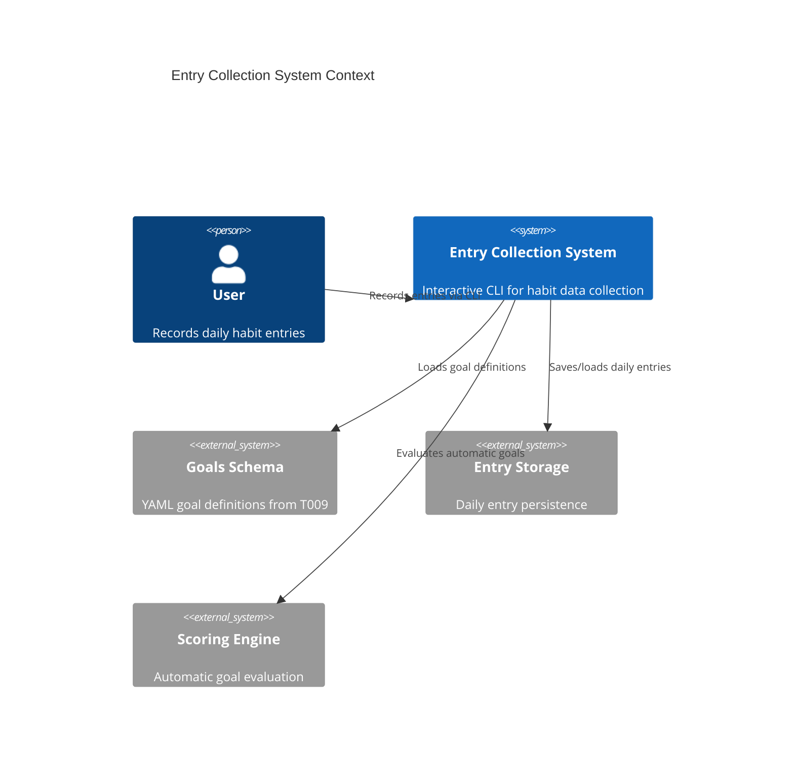
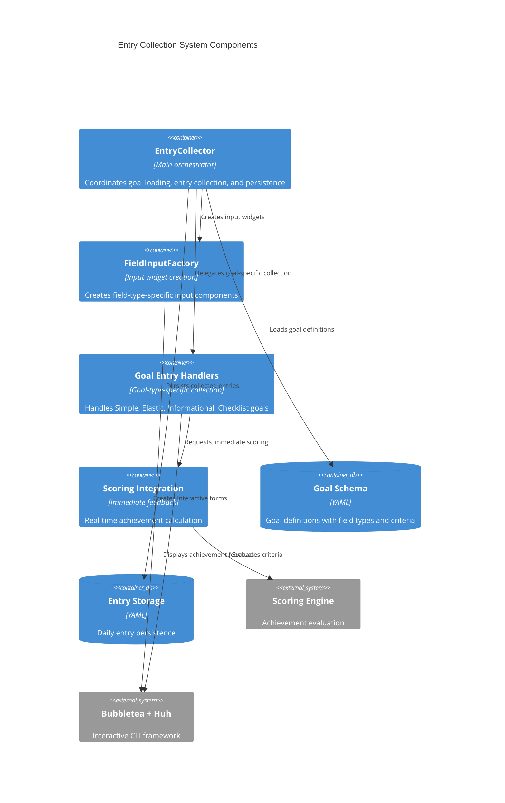
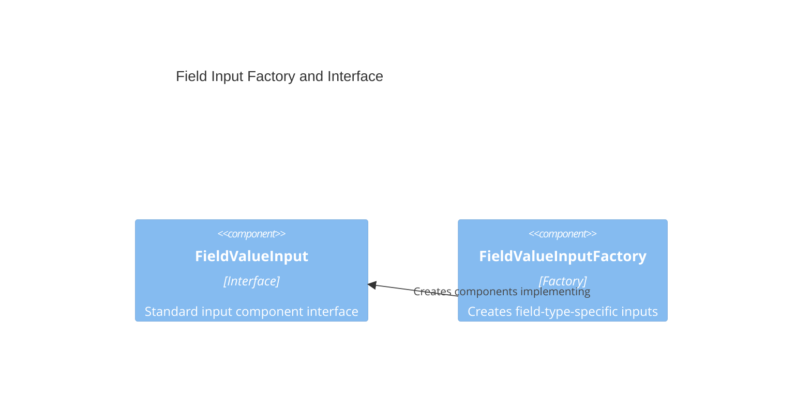
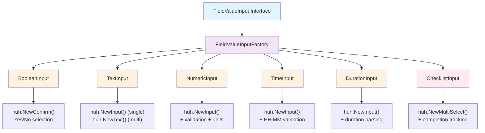
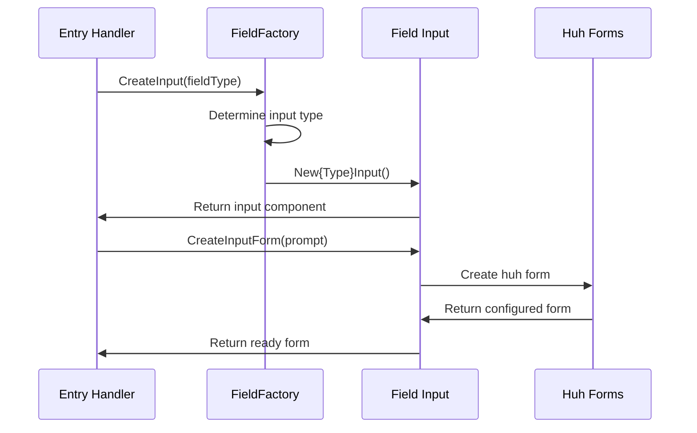
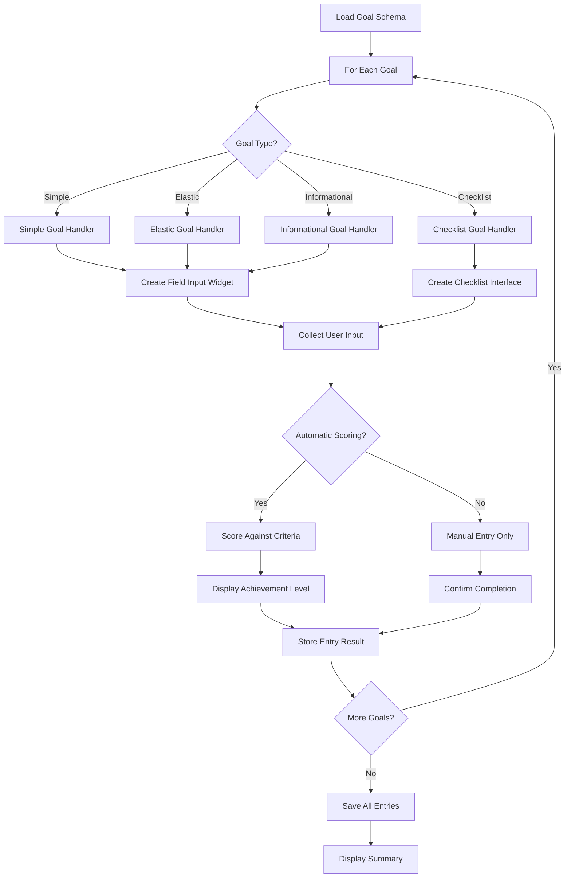
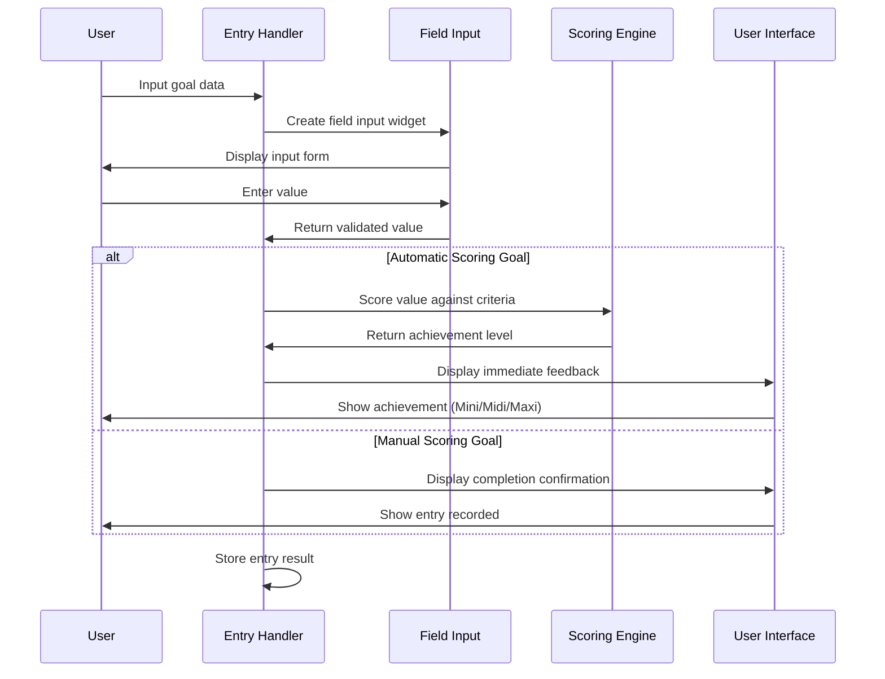

# Iter Entry: Goal Data Collection UI System

**Context (Background)**:
- CLAUDE.md (CLI patterns, bubbletea + huh framework usage)
- doc/workflow.md (task workflow, stopping conditions)
- doc/specifications/goal_schema.md (complete goal type and field type specifications)
- T009: Goal Management UI Redux (comprehensive goal configuration system)
- T005: Goal Configuration UI (foundation patterns)
- T007: Dynamic Checklist System (checklist goal support)

**Context (Significant Code Files)**:
- internal/ui/entry.go - Current entry collection system (basic implementation, 250+ lines)
- internal/ui/*_handler.go - Goal type-specific entry handlers (elastic_handler.go, informational_handler.go, etc.)
- internal/ui/goalconfig/ - Complete goal configuration system (patterns for field type handling)
- internal/models/goal.go - Goal and field type data models (SimpleGoal, ElasticGoal, InformationalGoal, ChecklistGoal)
- internal/models/entry.go - Entry data structures (DayEntry, GoalEntry, AchievementLevel)
- internal/scoring/ - Scoring engine for automatic goal evaluation
- internal/storage/ - Entry persistence system

## 1. Goal / User Story

As a user, I want to efficiently record daily habit entries through an intuitive CLI interface that adapts to each goal's type and field configuration, providing immediate feedback and automatic scoring where applicable.

**Current State Assessment:**
Based on T009's comprehensive goal configuration system and existing entry.go implementation:

- ✅ **Goal Loading**: Goals loaded from YAML schema with all goal types supported
- ✅ **Basic Entry Flow**: Skeleton entry collection loop exists for all goals
- ✅ **Storage Integration**: EntryStorage handles persistence to entries file
- ✅ **Scoring Integration**: ScoringEngine available for automatic evaluation
- ❌ **Field Type Adaptation**: Entry UI doesn't adapt to different field types (Boolean, Text, Numeric, Time, Duration, Checklist)
- ❌ **Goal Type Handling**: No specialized UI for Simple vs Elastic vs Informational vs Checklist goals
- ❌ **Automatic Scoring**: Scoring engine not integrated with entry collection
- ❌ **Achievement Feedback**: No immediate feedback for elastic goal achievement levels
- ❌ **Data Validation**: No field-level validation during entry
- ❌ **Interactive Experience**: Basic placeholder implementation lacks bubbletea + huh patterns

**User Story:**
I want an entry system that:
- **Adapts to Goal Types**: Different interaction patterns for Simple (pass/fail), Elastic (mini/midi/maxi), Informational (data-only), and Checklist goals
- **Field Type Awareness**: Appropriate input widgets for Boolean, Text, Numeric, Time, Duration, and Checklist fields
- **Immediate Scoring**: Automatic evaluation with instant feedback for goals with criteria
- **Data Validation**: Real-time validation with helpful error messages
- **Progress Feedback**: Clear indication of completion status and achievement levels
- **Efficient Flow**: Streamlined experience following established CLI patterns from T009/T005

## 2. Acceptance Criteria

### Core Entry Collection System
- [ ] **Goal Type Adaptation**: Entry UI adapts to Simple, Elastic, Informational, and Checklist goal types
- [ ] **Field Type Support**: Appropriate input widgets for all field types (Boolean, Text, Numeric, Time, Duration, Checklist)
- [ ] **Automatic Scoring Integration**: Goals with criteria automatically evaluated with immediate feedback
- [ ] **Manual Scoring Support**: Manual goals collect data without automatic evaluation
- [ ] **Achievement Level Display**: Elastic goals show achieved level (None, Mini, Midi, Maxi) immediately

### Field Type Input Widgets
- [ ] **Boolean Fields**: Yes/No prompt with clear completion indication
- [ ] **Text Fields**: Single-line and multiline text input with optional comment support
- [ ] **Numeric Fields**: Number input with unit display, min/max validation, subtype awareness
- [ ] **Time Fields**: HH:MM time input with validation (00:00-23:59)
- [ ] **Duration Fields**: Flexible duration input (30m, 1h 30m, 90m) with validation
- [ ] **Checklist Fields**: Interactive checklist completion with progress tracking

### Goal Type-Specific Behaviors
- [ ] **Simple Goals**: Clear pass/fail collection with optional additional data
- [ ] **Elastic Goals**: Data collection with immediate mini/midi/maxi achievement calculation
- [ ] **Informational Goals**: Data collection without pass/fail evaluation
- [ ] **Checklist Goals**: Interactive checklist item completion with progress feedback

### User Experience Features
- [ ] **Validation Feedback**: Real-time validation with clear error messages
- [ ] **Progress Indication**: Show current goal position (e.g., "Goal 3 of 7")
- [ ] **Achievement Feedback**: Immediate scoring results with achievement level display
- [ ] **Skip/Edit Options**: Ability to skip goals or edit previous entries within session
- [ ] **Summary Display**: Completion summary with achievement overview

### Technical Requirements
- [ ] **Bubbletea Integration**: Follow established patterns from T009 goal configuration system
- [ ] **Field Type Reuse**: Leverage field configuration logic from goalconfig system
- [ ] **Scoring Engine Integration**: Seamless integration with existing scoring.Engine
- [ ] **Entry Persistence**: Proper integration with storage.EntryStorage
- [ ] **Error Handling**: Comprehensive error handling with user-friendly messages
- [ ] **Testing Strategy**: Headless testing approach similar to T009 (NewEntryCollectorForTesting)

# Architecture

## System Overview

The `iter entry` system provides field-type-aware data collection for all goal types with immediate scoring feedback. Built on the foundation established by T009's goal configuration system, it reuses proven bubbletea + huh patterns while integrating seamlessly with the existing scoring engine.

## Core Architecture Components

## Component Architecture

## Field Input Component System

### Interface and Factory Pattern

### Input Component Hierarchy

### Component Creation Flow

## Goal Type Collection Flow

## Field Type to Input Widget Mapping

| Field Type | Huh Widget | Key Features | Validation |
|------------|------------|--------------|------------|
| Boolean | `huh.NewConfirm()` | Yes/No confirmation | Built-in boolean validation |
| Text (single) | `huh.NewInput()` | Standard text input | Required/optional validation |
| Text (multi) | `huh.NewText()` | Multi-line text area | Length limits, newline support |
| Numeric (all) | `huh.NewInput()` | Number input with unit display | Type validation + min/max constraints |
| Time | `huh.NewInput()` | HH:MM format | Time format validation (00:00-23:59) |
| Duration | `huh.NewInput()` | Flexible duration parsing | Duration format validation (1h 30m, 45m) |
| Checklist | `huh.NewMultiSelect()` | Multi-select interface | Completion state tracking |

## Scoring Integration Architecture

## Existing Foundation Integration

### Reusable Components from T009/T005
- **FieldValueInputFactory** (`internal/ui/goalconfig/field_value_input.go`) - Complete field input component system
- **Bubbletea + Huh Patterns** - Established in SimpleGoalCreator and ElasticGoalCreator
- **Validation Framework** - Type-specific validation with user-friendly error messages
- **Scoring Engine** (`internal/scoring/engine.go`) - Ready for integration with immediate feedback

### Entry System Foundation
- **EntryCollector** (`internal/ui/entry.go`) - Basic structure with proper dependencies
- **Handler Pattern** (`internal/ui/handlers.go`) - Goal-type-specific entry collection interface
- **Data Models** - Complete entry persistence with `models.DayEntry` and `models.GoalEntry`

### Integration Points
1. **Field Input Factory**: Direct reuse of existing `FieldValueInputFactory` for input widget creation
2. **Goal Type Handlers**: Extend existing handler pattern with bubbletea integration
3. **Scoring Integration**: Connect existing `scoring.Engine` for immediate achievement feedback
4. **Data Persistence**: Leverage existing `storage.EntryStorage` for entry saving/loading

## Design Principles

- **Component Reuse**: Leverage proven patterns from T009 goal configuration system
- **Field Type Awareness**: Adaptive UI based on field type configuration
- **Immediate Feedback**: Real-time scoring and achievement display for automatic goals
- **Pattern Consistency**: Follow established bubbletea + huh conventions
- **Testing Strategy**: Headless testing approach similar to goal configuration system
- **Error Handling**: Comprehensive validation with clear, actionable error messages

## 3. Implementation Plan & Progress

**Overall Status:** `Planning Phase`

**Architecture Analysis:**
Building on T009's successful goal configuration patterns and existing entry.go foundation:

**Current Foundation (from entry.go analysis):**
- ✅ EntryCollector struct with proper dependencies (goalParser, entryStorage, scoringEngine)
- ✅ Goal loading and basic collection loop structure
- ✅ Entry persistence and data model integration
- ✅ Welcome/completion displays with lipgloss styling
- ❌ collectGoalEntry() method is placeholder - core implementation needed
- ❌ No field type-specific input handling
- ❌ No goal type-specific UI patterns
- ❌ No scoring engine integration during collection

**Implementation Strategy:**
1. **Extend Entry Collection System** with goal type and field type awareness
2. **Create Field Input Components** following goalconfig patterns from T009
3. **Integrate Scoring Engine** for immediate feedback on automatic goals
4. **Add Interactive UI Components** using bubbletea + huh patterns
5. **Implement Comprehensive Testing** with headless testing infrastructure

**Sub-tasks:**

### Phase 1: Core Entry System Design
- [X] **1.1: Analyze Current Entry System & Requirements** ✅ **COMPLETED**
  - [X] Map field types to appropriate input widgets (leverage T009 field configuration patterns)
  - [X] Design goal type-specific collection flows (Simple vs Elastic vs Informational vs Checklist) 
  - [X] Plan scoring engine integration points for automatic evaluation
  - [X] Define entry validation and error handling patterns
  - [X] Create comprehensive architecture documentation with C4 diagrams

- [ ] **1.2: Design Field Input Component System**
  - [ ] Create field input interface following goalconfig patterns
  - [ ] Design Boolean, Text, Numeric, Time, Duration input components
  - [ ] Plan checklist input integration with existing checklist system
  - [ ] Define validation and error messaging patterns

- [ ] **1.3: Plan Goal Type-Specific Collection Flows**
  - [ ] Simple goal collection: pass/fail with optional additional data
  - [ ] Elastic goal collection: data input with mini/midi/maxi achievement feedback
  - [ ] Informational goal collection: data-only with direction awareness
  - [ ] Checklist goal collection: interactive checklist completion

### Phase 2: Field Input Implementation
- [ ] **2.1: Implement Core Field Input Components**
  - [ ] Boolean field input with clear yes/no prompting
  - [ ] Text field input (single-line and multiline) with validation
  - [ ] Numeric field input with unit display and constraint validation
  - [ ] Common validation and error messaging infrastructure

- [ ] **2.2: Implement Time and Duration Input Components**
  - [ ] Time field input with HH:MM format validation
  - [ ] Duration field input with flexible format support (30m, 1h30m, etc.)
  - [ ] Input parsing and validation with user-friendly error messages
  - [ ] Integration with existing time/duration field configuration

- [ ] **2.3: Integrate Checklist Input System**
  - [ ] Leverage existing checklist UI components from T007
  - [ ] Create entry-specific checklist completion interface
  - [ ] Add progress tracking and completion feedback
  - [ ] Integrate with checklist storage and validation

### Phase 3: Goal Type-Specific Collection
- [ ] **3.1: Implement Simple Goal Collection**
  - [ ] Pass/fail collection with Boolean field integration
  - [ ] Support for additional data fields (Text, Numeric, Time, Duration)
  - [ ] Automatic scoring integration for criteria-based Simple goals
  - [ ] Manual scoring support with completion confirmation

- [ ] **3.2: Implement Elastic Goal Collection**
  - [ ] Data collection with field type adaptation
  - [ ] Immediate mini/midi/maxi achievement calculation
  - [ ] Achievement level display with visual feedback
  - [ ] Integration with three-tier criteria from T009

- [ ] **3.3: Implement Informational Goal Collection**
  - [ ] Data-only collection without pass/fail evaluation
  - [ ] Direction-aware feedback (higher_better, lower_better, neutral)
  - [ ] Support for all field types with appropriate validation
  - [ ] Integration with existing informational goal patterns

### Phase 4: Integration and User Experience
- [ ] **4.1: Integrate Scoring Engine**
  - [ ] Real-time automatic scoring during data collection
  - [ ] Achievement level calculation for elastic goals
  - [ ] Immediate feedback display with achievement confirmation
  - [ ] Error handling for scoring failures

- [ ] **4.2: Enhanced User Experience**
  - [ ] Progress indication (current goal position)
  - [ ] Session navigation (skip, edit, review)
  - [ ] Completion summary with achievement overview
  - [ ] Enhanced styling following lipgloss patterns

- [ ] **4.3: Testing and Validation**
  - [ ] Headless testing infrastructure (NewEntryCollectorForTesting)
  - [ ] Unit tests for all field input components
  - [ ] Integration tests for goal type collection flows
  - [ ] End-to-end testing with real goal schemas

**Technical Implementation Notes:**
- **Pattern Consistency**: Follow bubbletea + huh patterns established in T009 goal configuration
- **Component Reuse**: Leverage field configuration and validation logic from goalconfig system  
- **Scoring Integration**: Seamless integration with existing scoring.Engine for immediate feedback
- **Data Model Alignment**: Ensure compatibility with models.DayEntry and models.GoalEntry structures
- **Error Handling**: Comprehensive validation with clear, actionable error messages
- **Testing Strategy**: Headless testing approach similar to T009's testing patterns

**AIDEV Anchor Comments Needed:**
- Entry flow dispatch logic for goal type routing
- Field input component selection and validation
- Scoring engine integration points
- Error handling and user feedback patterns

## 4. Roadblocks

*(Timestamped list of any impediments. AI adds here when a sub-task is marked `[blocked]`)*

## 5. Notes / Discussion Log

**2025-07-13 - Initial Task Design:**
- T009 provides complete goal configuration foundation with all goal types and field types supported
- Current entry.go provides basic structure but needs significant enhancement for field type and goal type awareness
- Key integration point: Scoring engine exists but not integrated with entry collection for immediate feedback
- Testing approach: Follow T009 patterns with headless testing infrastructure for comprehensive coverage
- UI patterns: Leverage bubbletea + huh patterns successfully established in goalconfig system

**T010/1.1 Analysis Complete (2025-07-13):**
- **Existing Foundation Confirmed**: FieldValueInputFactory in `internal/ui/goalconfig/field_value_input.go` provides complete field input component system ready for reuse
- **Input Widget Mapping**: All field types (Boolean, Text, Numeric, Time, Duration) have working huh-based implementations with validation
- **Goal Handler Pattern**: Established pattern in `internal/ui/handlers.go` with concrete implementations showing bubbletea integration
- **Scoring Integration Ready**: `internal/scoring/engine.go` provides `ScoreElasticGoal()` method for immediate achievement feedback
- **Architecture Designed**: Comprehensive C4 diagrams document component relationships, data flow, and integration points
- **Missing Component**: ChecklistInput widget needs implementation for checklist field type support
- **Next Step**: Direct reuse of FieldValueInputFactory with enhanced goal handlers for immediate scoring feedback

**Technical Dependencies:**
- **T009 Goal Configuration**: Provides complete goal type and field type support (prerequisite)
- **Existing Entry System**: Basic structure exists in internal/ui/entry.go (needs enhancement)
- **Scoring Engine**: Available in internal/scoring/ (needs integration)
- **Field Configuration**: Reusable components in internal/ui/goalconfig/ (leverage patterns)
- **Checklist System**: Existing checklist UI from T007 (integrate for checklist goals)

**Design Considerations:**
- **Goal Type Adaptation**: Each goal type needs specialized collection behavior
- **Field Type Awareness**: Input widgets must adapt to Boolean, Text, Numeric, Time, Duration, Checklist
- **Immediate Feedback**: Automatic scoring should provide instant achievement level feedback
- **Flow Efficiency**: Streamlined experience building on established CLI patterns
- **Data Validation**: Real-time validation with helpful error messages
- **Session Management**: Support for editing, skipping, and reviewing entries within session

## 6. Code Snippets & Artifacts 

*(AI will place larger generated code blocks or references to files here if planned / directed. User will then move these to actual project files.)*